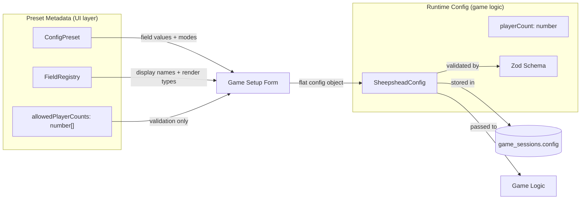
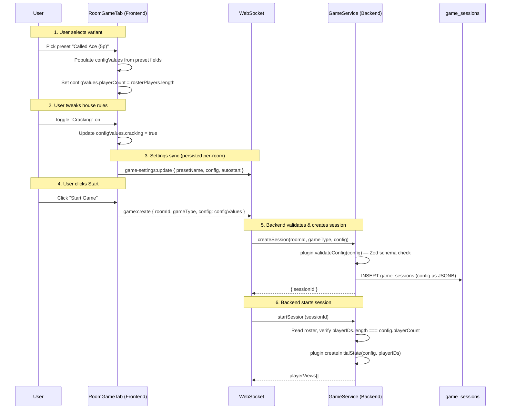
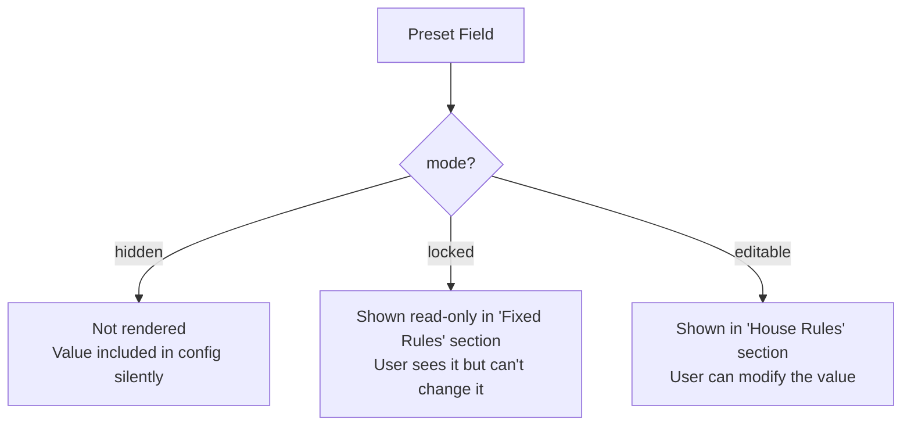

# Game Config & Preset System

How game configuration flows from preset definitions through the UI, across the wire, and into game logic. This doc is for developers building new game plugins or modifying the config system.

For the broader game engine architecture (state, store, events, the `GamePlugin` interface), see [game-engine.md](game-engine.md).

## Two Separate Concerns

The config system serves two distinct purposes that are easy to conflate:

1. **Preset metadata** — "What options does this game variant offer?" Used by the frontend to render the game setup UI and validate whether a game can start.
2. **Runtime config** — "What are the exact settings for this specific game session?" Stored in the database, passed to game logic, never changes during play.

These live in different types, flow through different paths, and should not be mixed up.



## Preset: What's Possible

A preset (`GenericConfigPreset` / `ConfigPreset`) describes a game variant. It is never stored in the database or sent to the backend as-is. It exists purely to drive the UI and validate user choices.

```typescript
interface GenericConfigPreset {
  name: string; // Internal identifier (e.g. 'called-ace')
  label: string; // Display name (e.g. 'Called Ace (5p)')
  description: string; // Tooltip / subtitle
  allowedPlayerCounts: number[]; // Which roster sizes work for this variant
  fields: Record<string, ConfigFieldDef<unknown>>;
}
```

Key points:

- `allowedPlayerCounts` is an array because a variant could theoretically support multiple player counts (e.g. `[4, 6]`). It is used only for frontend validation — checking whether the current roster size is compatible with the selected variant.
- `fields` maps each config key to a value, a mode (`hidden` / `locked` / `editable`), and optionally a list of allowed options (for select fields). Every preset lists every field explicitly — no inheritance, no defaults.
- The preset's `name` is persisted in the room's game settings so the UI can restore the selected variant on reload. But the preset object itself is not persisted.

## Config: What's Actual

The runtime config (e.g. `SheepsheadConfig`) is a flat object with concrete values. It's what gets:

- Validated by the Zod schema
- Stored in `game_sessions.config` (JSONB)
- Passed to every `GamePlugin` method (`createInitialState`, `applyEvent`, etc.)

```typescript
// Inferred from SheepsheadConfigSchema
type SheepsheadConfig = {
  name: string;
  playerCount: 2 | 3 | 4 | 5 | 6 | 7 | 8;  // single number, not an array
  handSize: number;
  blindSize: number;
  pickerRule: 'autonomous' | 'left-of-dealer' | null;
  partnerRule: 'called-ace' | 'jd' | 'jc' | /* ... */ | null;
  noPick: 'leaster' | 'moster' | /* ... */ | null;
  cracking: boolean;
  // ... more boolean/nullable fields
};
```

`playerCount` here is a single number — the actual number of players in this game session. It is not an array of allowed counts. That distinction belongs to the preset.

## The Full Data Flow



### Step by step

1. **Preset selection.** The user picks a variant from the dropdown. The frontend reads the preset's `fields` and populates `configValues` — a flat `Record<string, unknown>` that mirrors the Zod schema shape. It also sets `configValues.playerCount` to the current roster length.

2. **House rules.** The user can modify fields with `mode: 'editable'`. Fields with `mode: 'locked'` are shown read-only. Fields with `mode: 'hidden'` don't appear in the UI but their values are still included in `configValues`.

3. **Player count sync.** An Angular `effect` keeps `configValues.playerCount` in sync with `rosterPlayers().length`. If someone joins or leaves the room, the config updates automatically. This means the config always reflects the actual roster at the moment the game is created.

4. **Frontend validation.** Before the Start button is enabled, `validateGameForm` checks:
   - A game type is selected
   - A variant is selected
   - The roster count is in `preset.allowedPlayerCounts`

   This is a UI-only check using preset metadata. It prevents the user from starting a game with the wrong number of players.

5. **Backend validation.** `createSession` runs `plugin.validateConfig(config)` which calls `SheepsheadConfigSchema.safeParse(config)`. This validates the flat config object — including that `playerCount` is a valid number (2–8), `handSize` is positive, etc.

6. **Start-time guard.** `startSession` reads the actual roster and verifies `playerIDs.length === config.playerCount`. This catches any race condition where the roster changed between config submission and game start.

## How playerCount Works

This is the field most likely to cause confusion, so here's the explicit breakdown:

| Context             | Field                 | Type                              | Purpose                                       |
| ------------------- | --------------------- | --------------------------------- | --------------------------------------------- |
| Preset              | `allowedPlayerCounts` | `number[]`                        | "This variant works with these player counts" |
| Config (Zod schema) | `playerCount`         | `2 \| 3 \| 4 \| 5 \| 6 \| 7 \| 8` | "This game session has exactly N players"     |
| Frontend validation | `allowedPlayerCounts` | `number[]`                        | Checked against roster length before Start    |
| Backend validation  | `config.playerCount`  | `number`                          | Checked against actual roster at start time   |
| Game logic          | `config.playerCount`  | `number`                          | Used for dealing, seat math, etc.             |

The transition from "what's allowed" to "what's actual" happens in the frontend: when a preset is selected or the roster changes, `configValues.playerCount` is set to `rosterPlayers().length`. From that point on, it's a single number everywhere.

## Field Modes

Each field in a preset has a `mode` that controls how it appears in the UI:



All three modes contribute their value to `configValues`. The mode only affects UI rendering — the backend receives the same flat config regardless.

## Field Registry

The `FieldRegistry` maps each config field key to UI metadata:

```typescript
type FieldMetadata = {
  displayName: string; // "Hand Size"
  description: string; // "Number of cards dealt to each player."
  renderType: 'boolean' | 'select' | 'number' | 'nullable-number' | 'hidden-array';
};
```

The registry is intentionally metadata-only. It does not define values, modes, or options — those belong to presets. The frontend joins preset data with registry metadata at render time via `buildFieldEntries()`.

`renderType` determines which form control is rendered:

| renderType        | Control                                               |
| ----------------- | ----------------------------------------------------- |
| `boolean`         | Checkbox                                              |
| `select`          | Dropdown (options come from `SelectFieldDef.options`) |
| `number`          | Number input                                          |
| `nullable-number` | Number input + "No Limit" checkbox                    |
| `hidden-array`    | Not rendered (used for things like `cardsRemoved`)    |

## GameConfigPlugin

Each game library exports a `GameConfigPlugin` that bundles everything the frontend needs:

```typescript
interface GameConfigPlugin<K extends string = string> {
  label: string; // "Sheepshead"
  fieldRegistry: FieldRegistry<K>; // UI metadata for each field
  presets: readonly GenericConfigPreset[]; // All variant definitions
  configSchema: z.ZodType; // Zod schema for validation
}
```

The frontend's `GameRegistry` maps game type strings to `GameConfigPlugin` instances. The `RoomGameTab` component reads the active plugin and drives the entire form from it — no game-specific UI code.

## Creating a Config for a New Game

### 1. Define the Zod schema

```typescript
export const MyGameConfigSchema = z.object({
  name: z.string(),
  playerCount: z.union([z.literal(2), z.literal(3), z.literal(4)]),
  boardSize: z.number().int().positive(),
  useTimer: z.boolean(),
  // ...
});

export type MyGameConfig = z.infer<typeof MyGameConfigSchema>;
```

`playerCount` should always be a single-number union of the valid counts your game supports. The Zod schema validates the runtime config — the flat object that gets stored and passed to game logic.

### 2. Define the field registry

```typescript
export const FIELD_REGISTRY: FieldRegistry<'boardSize' | 'useTimer'> = {
  boardSize: {
    displayName: 'Board Size',
    description: 'Number of squares on each side.',
    renderType: 'number',
  },
  useTimer: {
    displayName: 'Use Timer',
    description: 'Enable a per-turn countdown.',
    renderType: 'boolean',
  },
};
```

Only include fields that appear in the UI. `name` and `playerCount` are handled automatically and don't need registry entries.

### 3. Define presets

```typescript
export const CONFIG_PRESETS: readonly ConfigPreset[] = [
  {
    name: 'standard',
    label: 'Standard (2p)',
    description: 'Classic two-player game.',
    allowedPlayerCounts: [2],
    fields: {
      boardSize: { value: 8, mode: 'locked' },
      useTimer: { value: false, mode: 'editable' },
    },
  },
  {
    name: 'quick',
    label: 'Quick (2–4p)',
    description: 'Smaller board, faster games.',
    allowedPlayerCounts: [2, 3, 4],
    fields: {
      boardSize: { value: 5, mode: 'locked' },
      useTimer: { value: true, mode: 'locked' },
    },
  },
];
```

Every preset must list every field. `allowedPlayerCounts` can have multiple values if the variant supports different group sizes.

### 4. Wire up the GameConfigPlugin

```typescript
export const MyGameConfigPlugin: GameConfigPlugin<'boardSize' | 'useTimer'> = {
  label: 'My Game',
  fieldRegistry: FIELD_REGISTRY,
  presets: CONFIG_PRESETS,
  configSchema: MyGameConfigSchema,
};
```

### 5. Register in the frontend

In `apps/frontend/src/app/game/game-registry.ts`, add your plugin:

```typescript
const GAMES: GameRegistry = {
  sheepshead: SheepsheadConfigPlugin,
  'my-game': MyGameConfigPlugin,
};
```

The `RoomGameTab` component will automatically render your game's presets and fields.
